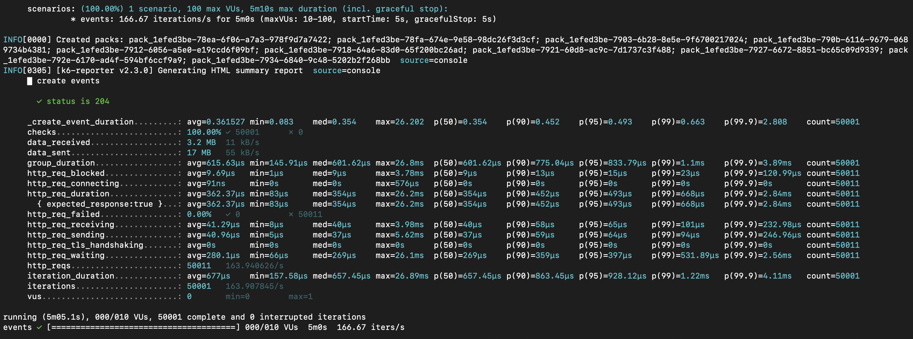

# pack-management
A Golang package track project.

## Project structure

The project is split by packages and domains.

### Domains:

- pack;
- pack event;
- person;
- holiday;
- metric;

### Endpoints:

- `[POST] /packs`:
```
curl --request POST \
  --url 'http://localhost:3300/packs' \
  --header 'Content-Type: application/json' \
  --data '{
 "description": "Livros para entrega",
 "sender": "Loja ABC 2",
 "recipient": "João Silva 2",
 "estimated_delivery_date": "2025-04-02"
}'
```
- `[PATCH] /packs`:
```
curl --request PATCH \
  --url 'http://localhost:3300/packs/pack_1efed39c-c88a-6dee-b937-c0b7c58cbee6' \
  --header 'Content-Type: application/json' \
  --data '{
	"status": "IN_TRANSIT"
}'
```
- `[GET] /packs`:
```
curl --request GET \
  --url http://localhost:3300/packs?page_size=100&page_cursor=
```
- `[GET] /packs/{id}`:
```
curl --request GET \
  --url http://localhost:3300/packs/pack_1efed39c-c88a-6dee-b937-c0b7c58cbee6
```
- `[POST] /packs/{id}/cancel`:
```
curl --request POST \
  --url 'http://localhost:3300/packs/pack_fc21351e-f5bc-4309-999c-f1c2f4893820/cancel'
```
- `[POST] /pack_events`:
```
curl --request POST \
  --url 'http://localhost:3300/pack_events?=' \
  --header 'Content-Type: application/json' \
  --data '{
	"pack_id": "pack_fc21351e-f5bc-4309-999c-f1c2f4893820",
	"description": "Pacote chegou ao centro de distribuição",
	"location": "Centro de Distribuição São Paulo",
	"date": "2025-01-20T15:13:59Z"
}'
```

_Note: You can use the [Insomnia file](./__docs/pack-management-api.json)._ 

### Folders:

- `cmd`: Contains the application entry point;
- `internal`: Contains all application resource, the domains and packages;
- `internal/pkg`: Contains the packages/libs that can be or not a external libs like: validators, database setup, helpers, pagination, etc;
- `internal/domain`: Contains the domains, the application's core are here;
- `test`: Contains the tests to the application;
- `test/helpers`: Contains the helpers used only in the tests;
- `test/integration`: Contains the application integration tests split by domains;
- `scripts`: Contains any util script;
- `scripts/db`: Contains the database config migration config;

### Domain structure
The domain structure is made of 5 base files:
- entity.go: The domain entities definations;
- handler.go: The http handlers, if the domain has more than 1 handler type then split it in more files, e.g: handler_http.go and handler_sqs.go;
- service.go: The all business logic;
- repository.go: Is the repository interface, a domain can have more than a kind of reposity, e.g: mysql, postgres, file, etc;
- repository_mysql.go:  The MySQL repository implementation. This project is only using mysql as repository;

_Note: All implementations are using dependency injection._ 

### Database:

This project uses MySQL database, it runs on docker.

#### Model:


#### Tables:
- pack: The package informations;
- pack_event: The package event track;
- person: Generic table to save the "persons" (AKA: sender and recipient);
- holiday: To cache the holidays returned from the API, it could be useful to add specific holidays too.

### Observability
The project exports server and database metrics to be used with Prometheus,
endpoint: `/metrics`.

### Async
This projects implements async calls to externals APIs and async process.

In the pack domain, it's used go routines to call the DogAPI and DateNager API. [see here](./internal/domain/pack/service.go#L99)

In the pack_event domain, it's used gorountine and channel to create and process a event InMemory queue. [see here](./internal/domain/packevent/service.go#L55)


## TODO (Improvements):

- Create alerts to notify about get funfact and holiday fails;
- Create recovery endpoints to handler packs with funfact or holiday fails;
- Replace InMemory (channel + goroutine) event process queue to an external queue, or implment a inbox strategy.
- Changes the create pack payload to receive the sender and reciver ID instead of names. It will allow us to split the person domain to another service.
-

## Setup

This project is using the Go version `1.23.6` and uses asdf to manage the it:

- asdf: https://github.com/asdf-vm/asdf
- Golang asdf plugin: https://github.com/asdf-community/asdf-golang

Install Golang using asdf:

```sh
asdf install && asdf reshim golang
```

_Note: **This is only necessary if there isn't Go version installed**._

## Run local

1. **Set environment variables in the .env and .env.test files**: `cp .env.example .env && cp .env.example .env.test`

_Note: The `DB_USER` env variable of .env.test file need to has `create database` permission, e.g.: root user;_

2. **Install deps**: `make install`.
   If you're using asdf, run the reshim command `asdf reshim golang`;

3. **Run**: `make run`;

_Note: It will build and run the database image too._

## Run integration tests

```sh
make test-e2e
```

## Run load test

To run load teste go to [load test folder](./__loadtest/README.md)

## Load test results

The load tests were executed local on a M3 Pro chip with 18GB of RAM.

**Create, cancel and update pack**:


**Create pack events**:

